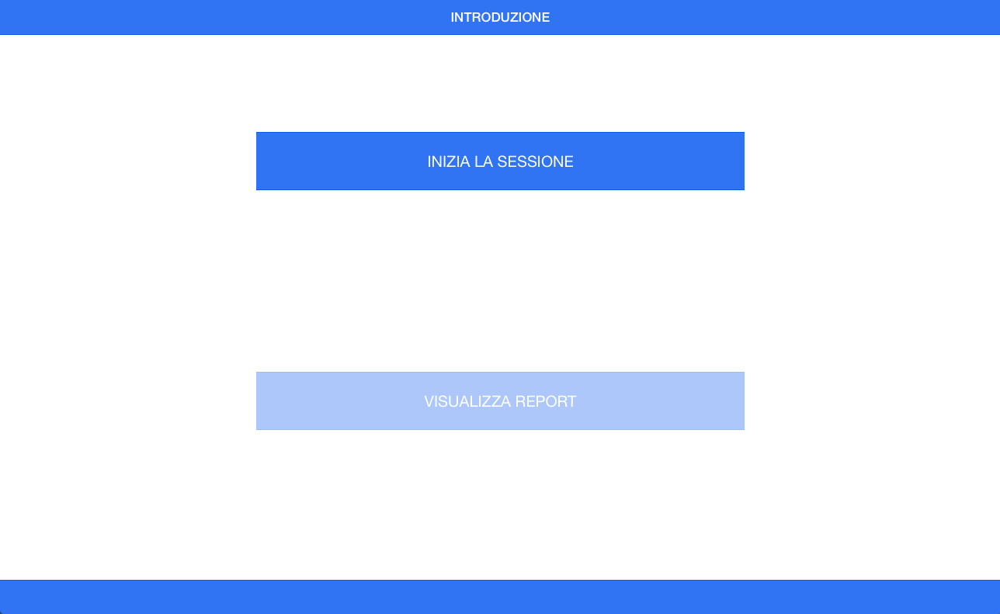

# Design4All Pilot App

## Description
This mobile app is developed by DT&M Group for evalute evaluate attitude to technology of elderly people. 



According to the "Design for all" paradigm, a pilot study is planned, aimed at analysing the human system interaction of the developed interface, in order to gain information on adaptable and adaptive features.

For this purpose, three significant classes of users have been selected in order to have an appropriate users plethora, necessary to characterize  the different  usability and functionality levels of the interface and identify  different design proposals, these are:

* __Cognitive disorders users__: related to memory (indicators: procedural memory, short-term perspective) and Warning (indicators: visuo-spatial deficits, attention difficulties generalized);
* __Sensory impairments users__: related to View  (indicators: diabetic retinopathy, cataracts, colour blindness, macular degeneration, glaucoma) and Hearing (indicators: mild or moderate hearing loss);
* __Motor disorder users__:  (indicators: manipulation, the ability to make fine movements)


To this end, six key objectives have been identified: 

1. Evaluation of the tapping ability compared to  size, location and contrast of the icons.
2. Action of pinching skills assessment in relation to size, location, and contrast of the icons.
3. Pinch \& span ability evaluation in relation to size, location, and contrast of the icons.
4. Icons position adequacy assessment.
5. Text adequacy assessment.
6. Scroll on action ability evaluation.

The evaluation of the users' performance will be based on the analysis of:

* Adaptability of the text elements: font, text size, contrast and position of the text;
* Adaptivity of the icons: size, position and contrast;
* Adaptivity of Interface Layout: iconic, textual, hybrid;
* Subjective skills in the use of technology (tap, pinch, pinch span, scroll);
* Appropriateness of features characteristics.

The app is able to monitoring the __user interaction__ of the different sessions and
## Requirements
* Node/ NPM
* MongoDB

## Configuration
The configuration of app is describes in the following steps. 
The guide is written for OSX System (in particular step 1 and 2).

### 1. MongoDB Installation (with Homebrew)
Open Terminal and write the command below.

```
    brew update      
```

```
brew install mongodb
```

For more details see [MondoDB Documentation](http://docs.mongodb.org/manual/tutorial/install-mongodb-on-os-x/).

### 2. Install Nodejs
Download the installation package from [https://nodejs.org](https://nodejs.org) and follow the instructions.

### 3. Download Repo and Nodejs Depencencies
Download the application folder and enter in through terminal application.

```
cd ~/path-to-folder/d4apilot/
```

Install the dependencies of nodejs modules:

```
npm install
```

### 4. Start server-side application
Open a shell tab in Terminal and Start MongoDb database typing:

```
mongod
```

In another tab start the server application:

```
cd ~/path-to-folder/d4apilot/
```

```
node server.js
```

### 5. Configure Network Connection
The application is designed with a client-server architecture, so it is important that the server-side application (running on a pc or mac) and the client device (tablet) is in the same wifi network. 

For more information see [Apple Documentation](https://support.apple.com/kb/PH13796?viewlocale=en_US&locale=us_US).

When both physical device are connected to the same network, check the IP Address of server device (looks like ```xxx.xxx.xxx.xxx```). 

From the mobile device, go to the web site : ```http:/xxx.xxx.xxx.xxx:3000``` and start to use the application.

##Credits
The mobile application is designed by: [Roberta Bevilacqua](mailto:robibevi@yahoo.it), [Lorenzo Cavalieri](mailto:lorenzo.cavalieri@univpm.it), [Silvia Ceccacci](mailto:s.ceccacci@univpm.it), [Francesca Gullà](mailto:f.gulla@univpm.it) and developed by [Lorenzo Cavalieri](mailto:lorenzo.cavalieri@univpm.it).

The application uses [ionic framework](http://ionicframework.com), with [nodejs](https://nodejs.org) and [mongoDB](https://www.mongodb.org) to manage the server-side implementation.

##License
The MIT License (MIT)

Copyright (c) 2015 UNIVPM - DTM&Group 

Permission is hereby granted, free of charge, to any person obtaining a copy of this software and associated documentation files (the "Software"), to deal
in the Software without restriction, including without limitation the rights to use, copy, modify, merge, publish, distribute, sublicense, and/or sell
copies of the Software, and to permit persons to whom the Software is furnished to do so, subject to the following conditions:

The above copyright notice and this permission notice shall be included in all copies or substantial portions of the Software.

THE SOFTWARE IS PROVIDED "AS IS", WITHOUT WARRANTY OF ANY KIND, EXPRESS OR IMPLIED, INCLUDING BUT NOT LIMITED TO THE WARRANTIES OF MERCHANTABILITY, FITNESS FOR A PARTICULAR PURPOSE AND NONINFRINGEMENT. IN NO EVENT SHALL THE AUTHORS OR COPYRIGHT HOLDERS BE LIABLE FOR ANY CLAIM, DAMAGES OR OTHER LIABILITY, WHETHER IN AN ACTION OF CONTRACT, TORT OR OTHERWISE, ARISING FROM, OUT OF OR IN CONNECTION WITH THE SOFTWARE OR THE USE OR OTHER DEALINGS IN THE SOFTWARE.